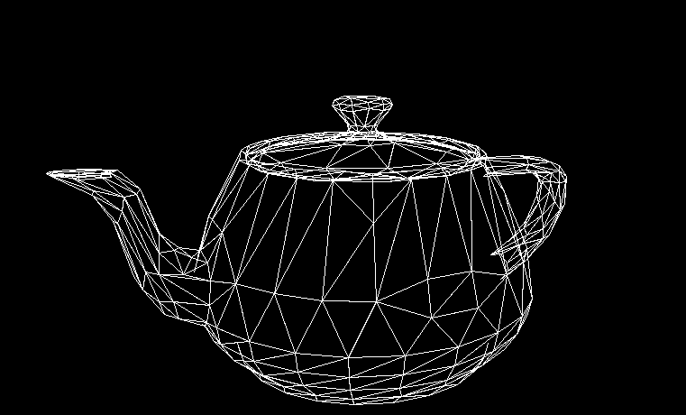
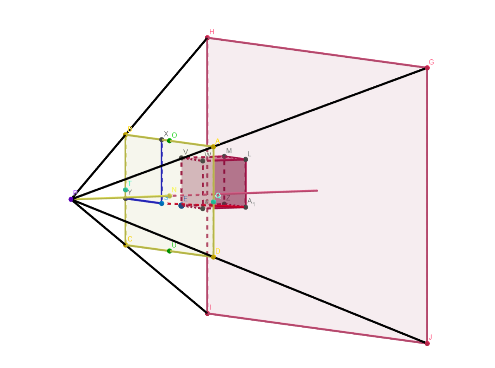

# Naive_3D_Renderer

## A dumb 3D renderer that doesn't use matrices, instead uses an actual simulated camera

## This is the stupid math that it uses, available on Geogebra [here](https://www.geogebra.org/m/gehjgrxz)

